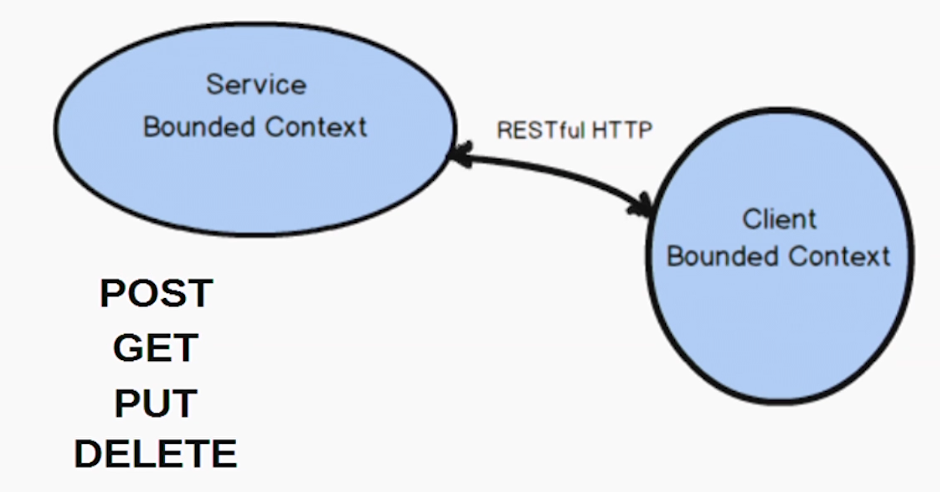

# Domain Driven Design

## Strategic design with Bounded Contexts and the Ubiquitous Language

### Bounded context

Contextual boundary where everything about a model is inside.

E.g.: <a name="collaboration-context">Collaboration</a> (Forum, discussions, posts), Identity and access management (user, role, permission), Support (Support plan, incident)

### Ubiquitous language

The meaning and definitions of terms with within a bounded context.

E.g.: French is spoken in France.

In order to develop a ubiquitous language we should develop scenarios of how specific objects/concepts work with other concepts  within the domain model to accomplish a specific scenario goal.

E.g.:

```
The product owner commits a backlog item to sprint. The backlog item may be commited only if it is already scheduled for release, and if a quorum of team members have approved commitment.

If it is already committed to a different sprint, it must be uncommitted first. When the commitment completes, notify the sprint from which it was uncommitted and the sprint to which it is now committed.
```

Given: Where our model is in a point in time and how its data is set.
When: A specific business operation occurs.
Then: We can assert that certains conditions are met.

```python
# Specification of acceptance test
Scenario: The product owner commits a backlog item to a sprint
Given a backlog item that is scheduled for release
And the product owner of the backlog item
And a sprint for commitment
And a quorum of team approval for commitment
When the product owner commits the backlog item to the sprint
Then the backlog item is committed to the sprint
And the backlog item committed event is created
```

### Domain experts

Has focus on a specific area of the business.

### Definition of bounded context and ubiquitous language

This is achieved by developers working along with domain experts.

Also what is out of a bounded context should be defined.

### Challenge and unify

We use this technique to break the Big ball of mud.

Ask if terms are part of a model.

### Architectures or Architectural patterns

Hexagonal architecture


Event-driven Architecture (Event sourcing)

Command Query Responsibility Segregation (CQRS)

Reactive and Actor Model

Rest

Microservices and SOA

## Strategic Design with Subdomains

### Subdomain (Area of expertise)
A portion of the business domain.

### Types of subdomain

#### Core domain
Where the organization is making strategic investment in software.

Addresses at what the organization must excel by means of software

How the organization wil distinguish from competitors.

E.g.: Scrum management application

#### Support subdomain

Necessary to support a core domain.

E.g.: [Collaboration context](#collaboration-context)

#### Generic subdomain

Necessary, but generic.

Consider purchasing to avoid heavy investment.

Consider out sourcing its development.

### Dealing with integration complexity of legacy code


Strive for the ideal modeling composition of 1:1 relationships between the bounded context and subdomain.


## Strategic Design with Context Mapping

### Kinds of mapping (5)

- Partnership: Two teams work on two different bounded contexts with a common goal.
    - Visual representation: Thick line
- Shared kernel: At least two teams have a very similar software model. So they develop a part of the model that both are going to use.
    - Visual representation: Intersection between the two circles with crossing lines fulfilling this part.
- Customer supplier: There is a well defined upstream and downstream between two teams. It means that changes on upstream team impacts the downstream team. These changes must be negotiated. The D team should request changes or features in the model they need.  
    - Visual representation: Line with U (Upstream) and D (Downstream)
- Conformist: Same as `Customer supplier` but in terms of `Model` where the upstream team model impacts the downstream team model. The downstream team will basically consume the upstream team model only since there is no resource or time to develop such a complex model.
- Anti-corruption layer: There is an upstream and downstream team but the downstream team does not want to influenced by the upstream team unnecessarily. Structured as the `Conformist` but the downstream team will consume the upstream team data and translates that to its own model by using an ACL (Anti-Corruption Layer).

- Open Host Service: Well documented and well defined model to consume.
- Published Language: The upstream team produces a well defined and documented exchange format that allows the donwstream team to consume data from upstream team.
- Separate Ways: Describes what kinds of integrations could take place between two teams. But for whatever reason the other team decides to create their own solution instead of consuming what the other team has developed.
- Big ball of mud: Changes in one part of the model impacts a model in another area. In order to integrate with a ball of mud try to use an `ACL` where the ball of mud is the upstream and your model is the downstream.

### Integration patterns with Context Mapping

#### RPC with soap


Disadvantage: Due to network failures tasks might not be completed.

#### RESTful HTTP



We can experience the same network issues.

Let clients consume data the way they want.

#### Messaging


If the message is delivered more than once the receiver should be able to deduplicate it.


## Tactical Design with Aggregates

An aggregate is a transactional consistency boundary.

Aggregate: Tactical modeling tool that helps us to design small and efficient object clusters that manage consistency constraints using transactions.

### Why
An aggregate has an aggregate root that may hold other entities and value objects (has value on its own. It is not an aggregate).

The name of the aggregate root is the name of the entire aggregate.

Everything inside an aggregate must e consistent at the end of a transaction.

### Rules of thumb (4)

#### Protect business invariants inside aggregate boundaries
If there are state changes within the aggregate, this should happen in the same transaction.


#### Design small aggregates
Large aggregates can cause:
- Concurrency failures
- Large memory usage
-  Garbage collection issues
-


Small aggregates


#### Reference other aggregates by identity only


#### Update other aggregates using eventual consistency
To achieve this we use messaging mechanisms by publishing a domain event to interested parties.

The publishing bounded context publishes a domain event to the messaging mechanism so the subscribing bounded context receives the domain event notification and reacts to it in a separate transaction.


### Modeling aggregates

Remember that an aggregate is a transactional consistency boundary.


Use public getters and private setters so internal values can be changed only through a defined behaviour named accordingly to the ubiquitous language.


### Level of abstractions

Do not try to make abstractions when naming entities.
E.g.: Sprint -> ScrumElement(type:String)

Stick to the ubiquitous language spoken by the domain experts.

The problems with wrong abstractions lead to:
- Hard to model details of specific details
- Special cases and comple class hierarchy
- More code than necessary if modeling explicitly
- Will influence the user interface negatively
- Wast time and money pursuing wrong design

### Right-sizing aggregates

Steps:
- Start with rule 2. Design small aggregates;
- Apply rule 1. Make a chart with aggregat names and list dependents under each;
- Ask domain experts for an acceptable time frame for updates to each dependent, for: immediate, eventually( N seconds).
- House all immediate components under one single aggreate.
- Plan to update all eventual updates through a domain event.


A1 and A2 will be updated within the same transaction and C14 will be eventually updated when it receives the domain event notification.

### Design for unit test

- Using rule 2 will help make aggregates testable;
- Test for correctness and robustness of each component;